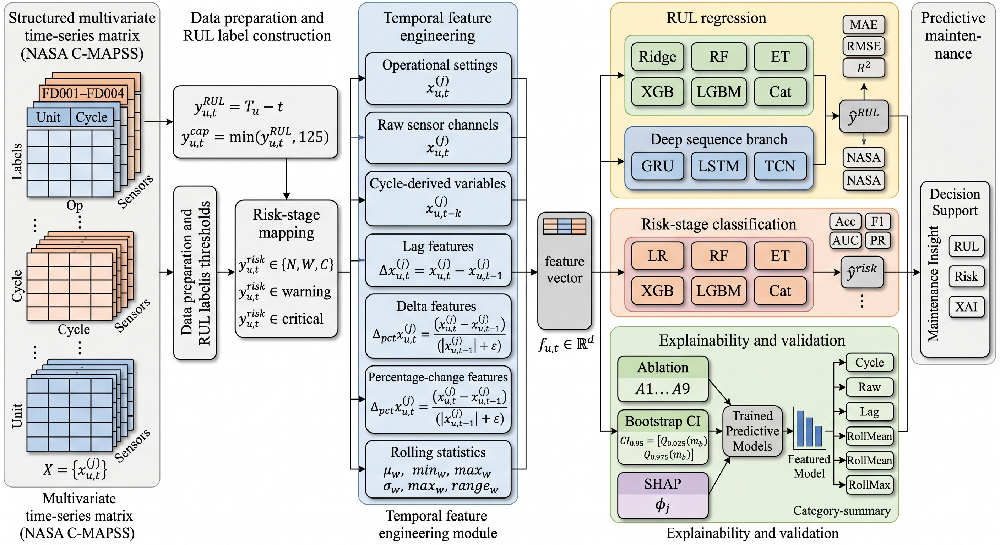
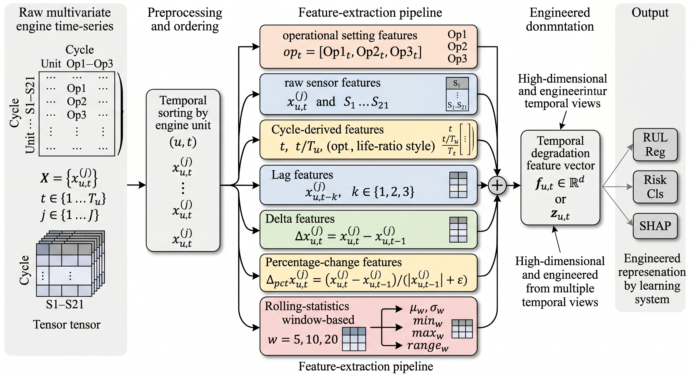
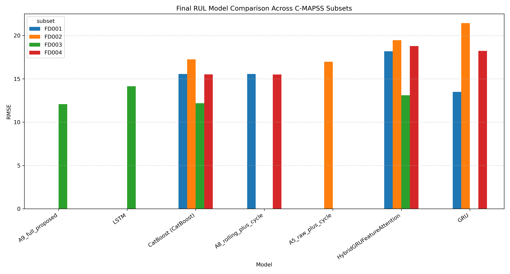
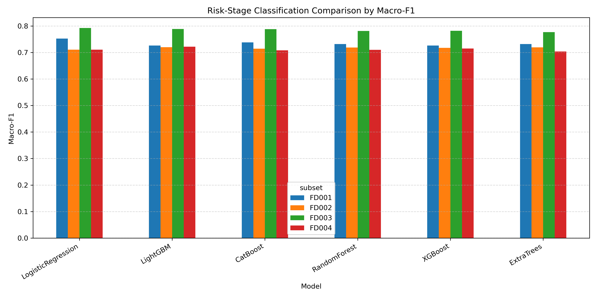
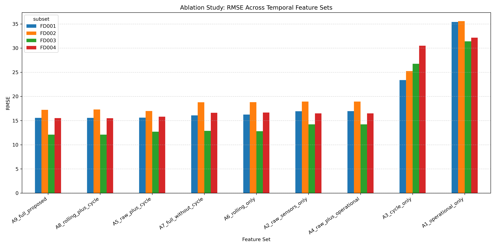
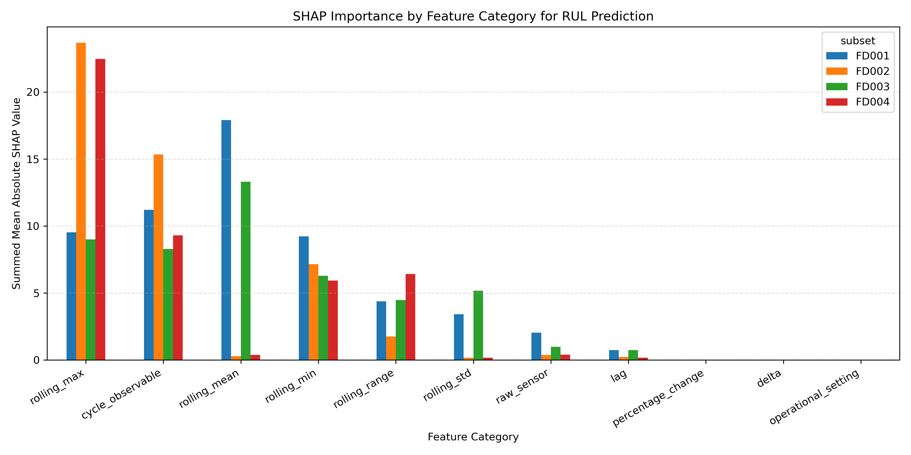

# Explainable Temporal Degradation Feature Framework for RUL Prediction and Risk Assessment

> **A reproducible predictive-maintenance research pipeline for Remaining Useful Life (RUL) prediction, degradation risk-stage classification, temporal feature ablation, bootstrap statistical validation, deep sequence comparison, and SHAP-based explainability on the NASA C-MAPSS turbofan engine benchmark.**

<p align="center">
  
</p>

<p align="center"><b>Fig. 1.</b> Overall framework for explainable RUL prediction and risk assessment.</p>

---

## Table of Contents

- [1. Project Overview](#1-project-overview)
  - [1.1 Research Motivation](#11-research-motivation)
  - [1.2 Recommended Paper Title](#12-recommended-paper-title)
  - [1.3 Core Research Claim](#13-core-research-claim)
  - [1.4 Main Contributions](#14-main-contributions)
- [2. Dataset](#2-dataset)
  - [2.1 Dataset Source](#21-dataset-source)
  - [2.2 Required Dataset Files](#22-required-dataset-files)
  - [2.3 Dataset Audit Summary](#23-dataset-audit-summary)
- [3. Methodology](#3-methodology)
  - [3.1 RUL Label Construction](#31-rul-label-construction)
  - [3.2 Risk-Stage Definition](#32-risk-stage-definition)
  - [3.3 Temporal Feature Engineering](#33-temporal-feature-engineering)
  - [3.4 Model Families](#34-model-families)
  - [3.5 Explainability and Statistical Validation](#35-explainability-and-statistical-validation)
- [4. Experimental Pipeline](#4-experimental-pipeline)
  - [4.1 Environment Setup](#41-environment-setup)
  - [4.2 Full Sequential Pipeline](#42-full-sequential-pipeline)
- [5. Main Results](#5-main-results)
  - [5.1 Best RUL Model by Subset](#51-best-rul-model-by-subset)
  - [5.2 Risk-Stage Classification](#52-risk-stage-classification)
  - [5.3 Ablation Study](#53-ablation-study)
  - [5.4 Bootstrap Confidence Intervals](#54-bootstrap-confidence-intervals)
  - [5.5 SHAP Explainability](#55-shap-explainability)
- [6. Generated Figures and Tables](#6-generated-figures-and-tables)
  - [6.1 Key Figures](#61-key-figures)
  - [6.2 Key Tables](#62-key-tables)
- [7. Repository Structure](#7-repository-structure)
- [8. Reproducibility](#8-reproducibility)
  - [8.1 Export Environment](#81-export-environment)
  - [8.2 Reproduce Major Results](#82-reproduce-major-results)
  - [8.3 Claim Boundary](#83-claim-boundary)
- [9. Paper Positioning](#9-paper-positioning)
  - [9.1 Suggested Manuscript Framing](#91-suggested-manuscript-framing)
  - [9.2 What Not to Claim](#92-what-not-to-claim)
  - [9.3 Remaining Work Before Submission](#93-remaining-work-before-submission)
- [10. Citation and License](#10-citation-and-license)

---

# 1. Project Overview

## 1.1 Research Motivation

Predictive maintenance aims to estimate the health condition of industrial systems before failure occurs. In turbofan engine prognostics, **Remaining Useful Life (RUL)** prediction is a key task because it supports maintenance scheduling, risk mitigation, and reliability-aware operation.

Many RUL prediction studies rely on deep sequence models with limited interpretability or use static feature representations that do not explicitly represent temporal degradation behavior. This project addresses that gap by building a complete, reproducible framework that combines:

1. Temporal degradation feature engineering.
2. RUL regression.
3. Degradation risk-stage classification.
4. Classical machine learning baselines.
5. Deep sequence baselines.
6. Feature-group ablation.
7. Bootstrap statistical validation.
8. SHAP-based explainability.

## 1.2 Recommended Paper Title

**An Explainable Temporal Degradation Feature Framework for Remaining Useful Life Prediction and Risk Assessment of Industrial Systems**

## 1.3 Core Research Claim

This project should be positioned as an **explainable temporal degradation feature framework**, not as a pure hybrid deep-learning model paper.

The strongest empirical claim is:

> Temporal degradation features provide robust and interpretable RUL prediction across complex C-MAPSS operating conditions, while also supporting degradation risk-stage classification and SHAP-based decision interpretation.

## 1.4 Main Contributions

1. A reproducible predictive-maintenance framework is developed for both RUL prediction and degradation risk-stage assessment using NASA C-MAPSS FD001–FD004 datasets.
2. A temporal degradation feature representation is designed by integrating raw sensor measurements, operational settings, cycle-derived variables, lag features, and rolling degradation statistics.
3. A comprehensive evaluation is conducted across classical machine learning, deep sequence baselines, hybrid feature-sequence learning, and feature-ablation variants.
4. A dual-task evaluation protocol is introduced, covering continuous RUL regression and discrete degradation risk-stage classification for **normal**, **warning**, and **critical** states.
5. Bootstrap confidence intervals and SHAP-based explainability are provided to assess performance stability and identify dominant temporal degradation patterns.

---

# 2. Dataset

## 2.1 Dataset Source

This project uses the **NASA C-MAPSS turbofan engine degradation benchmark**, one of the most widely used datasets for RUL prediction and aircraft engine prognostics.

The dataset contains four subsets:

1. FD001
2. FD002
3. FD003
4. FD004

Each subset contains multivariate engine time-series records, operational settings, sensor measurements, and test-set RUL labels.

## 2.2 Required Dataset Files

Place the dataset files under:

```text
data/raw/cmapss/
```

Required files:

```text
train_FD001.txt, test_FD001.txt, RUL_FD001.txt
train_FD002.txt, test_FD002.txt, RUL_FD002.txt
train_FD003.txt, test_FD003.txt, RUL_FD003.txt
train_FD004.txt, test_FD004.txt, RUL_FD004.txt
```

## 2.3 Dataset Audit Summary

| Subset | Train Rows | Test Rows | Train Units | Test Units | Missing Values |
|:--|--:|--:|--:|--:|--:|
| FD001 | 20,631 | 13,096 | 100 | 100 | 0 |
| FD002 | 53,759 | 33,991 | 260 | 259 | 0 |
| FD003 | 24,720 | 16,596 | 100 | 100 | 0 |
| FD004 | 61,249 | 41,214 | 249 | 248 | 0 |

---

# 3. Methodology

<p align="center">
  
</p>

<p align="center"><b>Fig. 2.</b> Temporal degradation feature engineering pipeline.</p>

## 3.1 RUL Label Construction

For each training engine unit, RUL is computed using the unit-specific maximum cycle:

$$
\mathrm{RUL}_{u,t} = C_u^{\max} - c_{u,t}
$$

where $C_u^{\max}$ is the final observed cycle of engine unit $u$, and $c_{u,t}$ is the current cycle at time index $t$.

For each test engine unit, RUL is computed using the observed maximum cycle and the official NASA RUL file:

$$
\mathrm{RUL}_{u,t} = C_{u,\mathrm{obs}}^{\max} + \mathrm{RUL}^{\mathrm{official}}_{u} - c_{u,t}
$$

A capped RUL target is used to reduce the dominance of very large early-life RUL values:

$$
\mathrm{RUL}^{\mathrm{capped}}_{u,t} = \min\left(\mathrm{RUL}_{u,t}, 125\right)
$$

## 3.2 Risk-Stage Definition

The risk-stage classification task is defined as:

$$
\mathrm{Stage}(\mathrm{RUL}) =
\begin{cases}
\mathrm{Critical}, & \mathrm{RUL} \leq 50 \\
\mathrm{Warning}, & 50 < \mathrm{RUL} \leq 125 \\
\mathrm{Normal}, & \mathrm{RUL} > 125
\end{cases}
$$

| Risk Stage | RUL Range | Interpretation |
|:--|:--|:--|
| Normal | $\mathrm{RUL} > 125$ | Low degradation risk |
| Warning | $50 < \mathrm{RUL} \leq 125$ | Medium degradation risk |
| Critical | $\mathrm{RUL} \leq 50$ | High degradation risk |

## 3.3 Temporal Feature Engineering

The proposed temporal feature representation includes:

1. Operational settings.
2. Raw sensor values.
3. Cycle-derived features.
4. Lag features.
5. First-order delta features.
6. Percentage-change features.
7. Rolling mean.
8. Rolling standard deviation.
9. Rolling minimum.
10. Rolling maximum.
11. Rolling range.

For a sensor variable $x_{u,t}^{(j)}$, the first-order lag and delta features are:

$$
x_{u,t-1}^{(j)}
$$

$$
\Delta x_{u,t}^{(j)} = x_{u,t}^{(j)} - x_{u,t-1}^{(j)}
$$

The percentage-change feature is:

$$
\Delta_{\mathrm{pct}} x_{u,t}^{(j)} =
\frac{x_{u,t}^{(j)} - x_{u,t-1}^{(j)}}{|x_{u,t-1}^{(j)}| + \epsilon}
$$

For a rolling window $w \in \{5,10,20\}$, the rolling mean is:

$$
\mu_{u,t,w}^{(j)} = \frac{1}{w}\sum_{k=0}^{w-1} x_{u,t-k}^{(j)}
$$

The rolling range is:

$$
\mathrm{range}_{u,t,w}^{(j)} = \max_{0 \leq k < w} x_{u,t-k}^{(j)} - \min_{0 \leq k < w} x_{u,t-k}^{(j)}
$$

Total model features:

```text
404 features
```

## 3.4 Model Families

### 3.4.1 Classical Machine Learning

1. Ridge Regression
2. Random Forest
3. Extra Trees
4. XGBoost
5. LightGBM
6. CatBoost

### 3.4.2 Risk-Stage Classification

1. Logistic Regression
2. Random Forest
3. Extra Trees
4. XGBoost
5. LightGBM
6. CatBoost

### 3.4.3 Deep Sequence Baselines

1. GRU
2. LSTM
3. Temporal CNN

### 3.4.4 Exploratory Hybrid Model

1. Hybrid GRU + tabular temporal feature attention model

## 3.5 Explainability and Statistical Validation

The framework includes:

1. SHAP feature-level interpretation.
2. SHAP feature-category analysis.
3. Bootstrap confidence intervals for regression performance.
4. Feature-group ablation study.
5. Comparison between temporal features and deep sequence baselines.

For a metric $m(\cdot)$ estimated through bootstrap samples $b = 1, \ldots, B$, the 95 percent confidence interval is obtained as:

$$
\mathrm{CI}_{0.95} =
[
Q_{0.025}(m_b),
Q_{0.975}(m_b)
]
$$

---

# 4. Experimental Pipeline

## 4.1 Environment Setup

Activate the Conda environment:

```powershell
conda activate main
```

Verify the environment:

```powershell
python src\00_check_environment.py
```

Expected environment components:

1. Python 3.11
2. PyTorch with CUDA
3. scikit-learn
4. XGBoost
5. LightGBM
6. CatBoost
7. SHAP
8. pandas, NumPy, SciPy, matplotlib

## 4.2 Full Sequential Pipeline

Run each script sequentially:

```powershell
python src\00_check_environment.py
python src\01_data_audit.py
python src\02_build_rul_labels.py
python src\03_feature_engineering.py
python src\04_train_ml_baselines.py
python src\05_generate_baseline_figures.py
python src\06_train_risk_classification.py
python src\07_generate_risk_classification_figures.py
python src\08_explain_shap_rul.py
python src\09_ablation_rul_features.py
python src\10_statistical_validation.py
python src\11_generate_q1_research_assets.py
python src\12_deep_sequence_baselines.py
python src\13_hybrid_feature_sequence_model.py
python src\14_generate_final_ieee_assets.py
python src\15_generate_manuscript_draft.py
python src\16_create_related_work_draft.py
python src\17_generate_method_diagrams.py
python src\18_generate_readme_reproducibility.py
python src\19_finalize_related_work_table.py
```
---

# 5. Main Results

## 5.1 Best RUL Model by Subset

| Subset | Best Family | Best Model | MAE | RMSE | $R^2$ | NASA Score |
|:--|:--|:--|--:|--:|--:|--:|
| FD001 | Deep Sequence | GRU | 9.9966 | 13.4930 | 0.7946 | 10,105.74 |
| FD002 | Best Ablation | A5 raw + cycle | 11.4830 | 16.9751 | 0.6532 | 189,621.31 |
| FD003 | Best Ablation | A9 full proposed | 7.3549 | 12.0842 | 0.7633 | 50,177.17 |
| FD004 | Best Ablation | A8 rolling + cycle | 9.5575 | 15.4924 | 0.6298 | 406,324.74 |

<p align="center">
  
</p>

<p align="center"><b>Fig. 3.</b> Final RUL model comparison across C-MAPSS subsets.</p>

## 5.2 Risk-Stage Classification

| Subset | Best Model | Accuracy | Macro Precision | Macro Recall | Macro F1 | ROC-AUC |
|:--|:--|--:|--:|--:|--:|--:|
| FD001 | Logistic Regression | 0.7621 | 0.7516 | 0.7540 | 0.7527 | 0.8978 |
| FD002 | LightGBM | 0.7448 | 0.7024 | 0.7439 | 0.7201 | 0.8886 |
| FD003 | Logistic Regression | 0.8209 | 0.7762 | 0.8116 | 0.7924 | 0.9260 |
| FD004 | LightGBM | 0.7916 | 0.7191 | 0.7258 | 0.7219 | 0.8953 |

<p align="center">
  
</p>

<p align="center"><b>Fig. 4.</b> Risk-stage classification comparison by Macro-F1.</p>

## 5.3 Ablation Study

Average ablation performance:

| Ablation | Average RMSE | Average MAE | Average $R^2$ | Features |
|:--|--:|--:|--:|--:|
| A9 full proposed | 15.1018 | 9.6308 | 0.6789 | 404 |
| A8 rolling + cycle | 15.1117 | 9.6368 | 0.6786 | 317 |
| A5 raw + cycle | 15.2728 | 9.7811 | 0.6715 | 23 |
| A7 full without cycle | 16.0889 | 11.1026 | 0.6352 | 402 |
| A6 rolling only | 16.1287 | 11.1268 | 0.6334 | 315 |
| A2 raw sensors only | 16.6468 | 11.6219 | 0.6110 | 21 |
| A3 cycle only | 26.4711 | 17.6342 | -0.0202 | 2 |
| A1 operational only | 33.6501 | 31.5260 | -0.5925 | 3 |

<p align="center">
  
</p>

<p align="center"><b>Fig. 5.</b> Ablation study: RMSE across temporal feature sets.</p>

Key finding:

> The full proposed temporal feature representation achieved the best average RMSE, while compact rolling-plus-cycle or raw-plus-cycle variants achieved strong subset-specific performance.

## 5.4 Bootstrap Confidence Intervals

| Subset | Model | RMSE | RMSE 95% CI | MAE | MAE 95% CI |
|:--|:--|--:|:--|--:|:--|
| FD001 | CatBoost | 15.5579 | 15.2913–15.8157 | 10.1112 | 9.9167–10.2965 |
| FD002 | CatBoost | 17.2465 | 17.0582–17.4116 | 11.5010 | 11.3727–11.6308 |
| FD003 | CatBoost | 12.1886 | 11.9664–12.4110 | 7.3984 | 7.2390–7.5415 |
| FD004 | CatBoost | 15.5127 | 15.3114–15.6983 | 9.6034 | 9.4910–9.7246 |

## 5.5 SHAP Explainability

SHAP analysis shows that:

1. Cycle-derived features are consistently influential.
2. Rolling mean features dominate FD001 and FD003.
3. Rolling maximum features dominate FD002 and FD004.
4. Raw sensors alone are less informative than temporal degradation statistics.
5. One-step delta and percentage-change features contribute relatively little.

<p align="center">
  
</p>

<p align="center"><b>Fig. 6.</b> SHAP feature-category importance summary.</p>

---

# 6. Generated Figures and Tables

## 6.1 Key Figures

| Figure | Path |
|:--|:--|
| Framework architecture | `paper/figures/fig_framework_architecture.png` |
| Temporal feature pipeline | `paper/figures/fig_temporal_feature_pipeline.png` |
| Final model comparison | `outputs/figures/fig_final_model_comparison_rmse.png` |
| Ablation RMSE comparison | `outputs/figures/fig_ablation_rmse_by_subset.png` |
| Feature count vs RMSE | `outputs/figures/fig_ablation_feature_count_vs_rmse.png` |
| Deep sequence RMSE comparison | `outputs/figures/fig_deep_sequence_rmse_comparison.png` |
| Risk-stage Macro-F1 | `outputs/figures/fig_risk_classification_macro_f1.png` |
| Risk-stage ROC-AUC | `outputs/figures/fig_risk_classification_roc_auc.png` |
| SHAP category summary | `outputs/figures/fig_shap_feature_category_summary.png` |

## 6.2 Key Tables

| Table | Path |
|:--|:--|
| Final model comparison | `outputs/tables/final_model_comparison_rul.csv` |
| Best RUL model by subset | `outputs/tables/final_best_rul_model_by_subset.csv` |
| Risk classification best models | `outputs/tables/best_risk_classification_by_subset.csv` |
| Ablation results | `outputs/tables/ablation_rul_results.csv` |
| Ablation average performance | `outputs/tables/ablation_average_performance.csv` |
| Bootstrap CI | `outputs/tables/stat_regression_bootstrap_ci.csv` |
| SHAP category summary | `outputs/tables/shap_feature_category_summary.csv` |
| Related work comparison | `outputs/tables/related_work_comparison_final.csv` |

---

# 7. Repository Structure

```text
predictive-maintenance-rul-ieee/
│
├── configs/
├── data/
│   ├── raw/cmapss/
│   ├── interim/
│   └── processed/
│       └── features/
│
├── outputs/
│   ├── figures/
│   ├── logs/
│   ├── metrics/
│   ├── models/
│   └── tables/
│
├── paper/
│   ├── figures/
│   ├── tables/
│   └── notes/
│
├── src/
│   ├── 00_check_environment.py
│   ├── 01_data_audit.py
│   ├── 02_build_rul_labels.py
│   ├── 03_feature_engineering.py
│   ├── 04_train_ml_baselines.py
│   ├── 05_generate_baseline_figures.py
│   ├── 06_train_risk_classification.py
│   ├── 07_generate_risk_classification_figures.py
│   ├── 08_explain_shap_rul.py
│   ├── 09_ablation_rul_features.py
│   ├── 10_statistical_validation.py
│   ├── 11_generate_q1_research_assets.py
│   ├── 12_deep_sequence_baselines.py
│   ├── 13_hybrid_feature_sequence_model.py
│   ├── 14_generate_final_ieee_assets.py
│   ├── 15_generate_manuscript_draft.py
│   ├── 16_create_related_work_draft.py
│   ├── 17_generate_method_diagrams.py
│   ├── 18_generate_readme_reproducibility.py
│   └── 19_finalize_related_work_table.py
│
├── requirements.txt
├── environment_main.yml
└── README.md
```

---

# 8. Reproducibility

## 8.1 Export Environment

```powershell
conda env export > environment_main.yml
pip freeze > requirements.txt
```

## 8.2 Reproduce Major Results

Run the complete pipeline sequentially:

```powershell
conda activate main
python src\00_check_environment.py
python src\01_data_audit.py
python src\02_build_rul_labels.py
python src\03_feature_engineering.py
python src\04_train_ml_baselines.py
python src\05_generate_baseline_figures.py
python src\06_train_risk_classification.py
python src\07_generate_risk_classification_figures.py
python src\08_explain_shap_rul.py
python src\09_ablation_rul_features.py
python src\10_statistical_validation.py
python src\11_generate_q1_research_assets.py
python src\12_deep_sequence_baselines.py
python src\13_hybrid_feature_sequence_model.py
python src\14_generate_final_ieee_assets.py
python src\15_generate_manuscript_draft.py
python src\16_create_related_work_draft.py
python src\17_generate_method_diagrams.py
python src\18_generate_readme_reproducibility.py
python src\19_finalize_related_work_table.py
```

## 8.3 Claim Boundary

This repository should be positioned as an **explainable temporal degradation feature framework**.

The hybrid feature-sequence model is included as an exploratory fusion baseline and should **not** be claimed as the best-performing method.

Local PowerShell runner scripts may be used privately, but they are intentionally not required for repository reproduction; the public pipeline is fully reproducible through the numbered Python scripts in `src/`.

---

# 9. Paper Positioning

## 9.1 Suggested Manuscript Framing

The recommended manuscript framing is:

> Explainable temporal degradation feature engineering for RUL prediction and risk-stage assessment.

This framing is consistent with the empirical results:

1. Engineered temporal features achieve the best performance on FD002, FD003, and FD004.
2. GRU performs best on FD001.
3. The hybrid model does not outperform the strongest ablation or deep sequence baselines.
4. SHAP analysis supports the interpretability of rolling degradation statistics.

## 9.2 What Not to Claim

Do **not** claim:

1. The hybrid model is the best-performing model.
2. The proposed method outperforms all deep learning methods in the literature.
3. The model is validated on real industrial deployment data.
4. Risk-stage classification replaces expert maintenance decisions.

## 9.3 Remaining Work Before Submission

1. Finalize related-work comparison with exact paper citations.
2. Polish all figures into final IEEE style.
3. Write the full manuscript sections.
4. Add formal citation and license.
5. Check for data leakage and overclaiming.

---

# 10. Citation and License

## 10.1 Citation

If this project is used, cite the future manuscript:

```bibtex
@article{rul_temporal_feature_framework_2026,
  title   = {An Explainable Temporal Degradation Feature Framework for Remaining Useful Life Prediction and Risk Assessment of Industrial Systems},
  author  = {Mochamad Rizal Fauzan},
  journal = {To be submitted},
  year    = {2026}
}
```

## 10.2 License

Add a license before public release. Recommended options:

1. MIT License for code.
2. CC BY 4.0 for documentation and generated figures.

